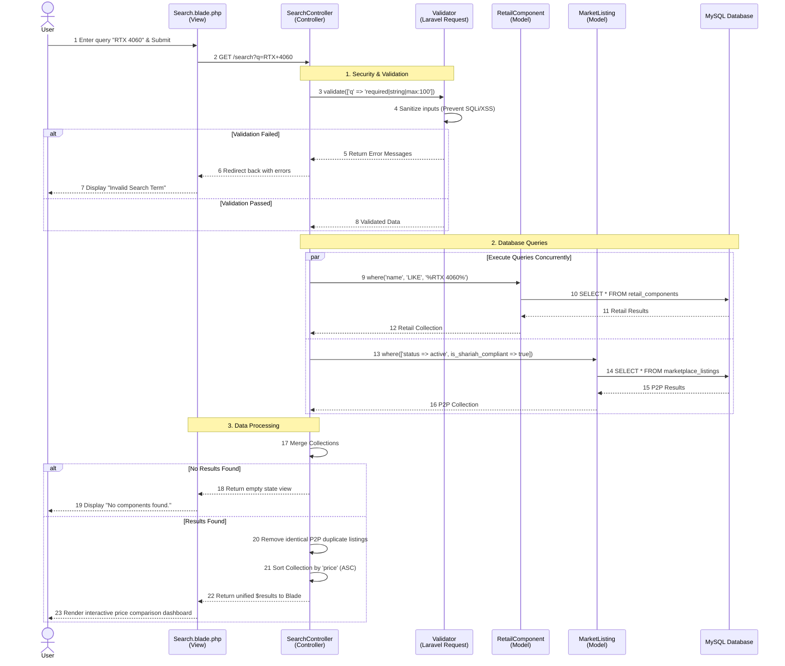

# PROJECT PROPOSAL GUIDELINES 
### BIIT 2305 
### PROPOSAL FOR PROJECT DEVELOPMENT 
### BigRadar: Centralized PC Component Locator & Marketplace 
### GROUP 2 

| NAME | MATRIC NO. |
| :--- | :--- |
| HARITS DANISH BIN MOHD FAIRUZ | 2417417 | 
| DANISH ISKANDAR BIN MUHAMMAD ANNUAR | 2418095 | 
| MOHAMAD AZRELL HAFIZY BIN A HAMID | 2418013 | 
| MOHAMAD AFFIF AFIQ BIN MOHD AFFENDI | 2415445 | 
| DANIEL HAQIMI BIN MUHAMAD KAMAL | 2318163 | 

---

## PROPOSAL FOR PROJECT DEVELOPMENT 

### 1.1 INTRODUCTION
The proposed project is a web-based application, BigRadar, developed using the Laravel Model-View-Controller (MVC) framework.  BigRadar is a centralized hardware aggregator designed specifically for the niche market of PC builders, hardware enthusiasts, and gamers.  The application's criteria include a centralized dashboard featuring a cross-retailer search engine, dynamic price comparison, and a peer-to-peer (P2P) secondhand marketplace.  The system features full CRUD (Create, Read, Update, Delete) capabilities, allowing users to manage their marketplace listings, alongside an integrated search function to locate PC components effectively across multiple official retailers. 

### 1.2 PROBLEM DESCRIPTION

**1.2.1 Background of the problem** 
The application will be developed and deployed as a web application.  Currently, consumers looking to build or upgrade a PC must manually search across fragmented platforms.  They are forced to visit individual official retailer websites (such as All IT Hypermarket, Harvey Norman, and TMT) to check component availability and pricing.  This environment leads to inefficient data retrieval and a highly frustrating consumer experience when comparing prices.  Furthermore, if users want to buy or sell used parts, they must navigate to entirely separate platforms (like eBay or local forums) that lack integration with official retail pricing. 

**1.2.2 Problem Statement** 
The specific problems with existing consumer processes that this application will automate and enhance include: 
* Fragmented searching requires users to manually switch between multiple disconnected retailer websites to compare prices. 
* Lack of a centralized platform makes it difficult to search for specific hardware models, check real-time stock, and find the closest physical store locations quickly. 
* There is no unified platform that allows consumers to survey official brand-new retail prices and local secondhand marketplace listings simultaneously. 

### 1.3 PROJECT OBJECTIVE
The primary objective is to develop a unified web application that streamlines PC component surveying and purchasing under a single dashboard. 
* **Reports Produced:** At the end of the project, the system will produce consolidated view reports (data tables) of searched hardware, displaying aggregated pricing and availability from partnered retailers and user listings. 
* **Processes Automated:** The processes that will be automated include real-time search functionality to filter hardware data, seamless CRUD operations for users to manage their P2P marketplace listings, and automated sorting algorithms that compare prices across different vendors. 

### 1.4 PROJECT SCOPE

**1.4.1 Scope** 
The scope of BigRadar covers the backend database management and frontend user interface for three main operational modules: the Cross-Retailer Search Engine, the Price Comparison Module, and the Peer-to-Peer Marketplace Inventory. 

**1.4.2 Targeted User** 
The target users encompass PC builders, hardware enthusiasts, and gamers looking to source components, as well as private sellers looking to trade in or sell their used PC parts. 

**1.4.3 Specific Platform** 
The infrastructure required for development and execution involves XAMPP (Apache web server and MySQL database via phpMyAdmin) acting as the local server environment.  The application is built on the Laravel PHP framework utilizing Tailwind CSS for the frontend.  Because the project relies entirely on open-source web technologies, there are no specific hardware limitations;  users only require a standard web browser to access the system. 

### 1.5 CONSTRAINTS
The major constraints foreseen for this project development include: 
* **Time constraints:** The development, testing, and debugging phases must be rigorously scheduled to ensure completion within the academic semester timeline. 
* **Technical Learning Curve:** Adapting to Laravel's MVC architecture, mastering complex database queries for the search aggregator, and handling Tailwind CSS compilation requires significant initial research and troubleshooting. 

### 1.6 PROJECT STAGES
The major milestones for the project development are as follows: 
* **Phase 1:** Project Proposal & Requirements Gathering. 
* **Phase 2:** Database Design & Migrations (Structuring Users, Retailers, and Component Listings tables). 
* **Phase 3:** MVC Backend Setup (Establishing Models, Routing, and Resource Controllers). 
* **Phase 4:** Frontend Interface Development (Blade views, Forms, Dashboard integration). 
* **Phase 5:** System Testing (Validating search functionality, sorting algorithms, error handling, and finalizing the project report). 

### 1.7 SIGNIFICANCE OF THE PROJECT
The benefits of this project for the targeted users include: 
* **Consumers/Buyers:** Greatly reduces the time and effort required to build a PC by centralizing price comparisons and stock availability into a single, easily navigable digital dashboard. 
* **Private Sellers:** Provides a dedicated, niche marketplace to list used components directly alongside retail prices, ensuring fair market value and visibility among targeted enthusiasts. 

### 1.8 FEATURES AND FUNCTIONALITIES
Based on the project requirements and RigRadar proposal, here are the core features and functionalities: 
* **Centralized Hardware Dashboard:** The system provides a single, unified interface for users to search for PC components without switching between disconnected retail systems. 
* **Cross-Retailer Search Functionality:** The system features real-time search capabilities to quickly filter hardware data and locate specific models across different official stores. 
* **Dynamic Price Comparison:** Automated comparison tables that rank components by price and highlight real-time stock availability. 
* **P2P Marketplace Module:** Users can perform complete CRUD (Create, Read, Update, Delete) operations to digitally manage and maintain their own secondhand part listings. 
* **Secure User Authentication (Consumers & Sellers):** The application features a secure user login system to ensure that PC builders and hardware enthusiasts can safely manage their personal profiles, price-comparison wishlists, and secondhand marketplace inventory. 
* **Automated Database Validation:** To ensure high data integrity across both the official retail aggregator and the P2P marketplace, the system utilizes strict validation rules.  These rules automatically trigger error alerts and prevent duplicate entries, such as identical secondhand listing submissions by a user or duplicate retail SKU (Stock Keeping Unit) registrations. 
* **Secure Administrative Access:** A strict, role-based authentication portal ensures that only authorized retail partners and system administrators can access, manage, and modify official store inventories and overarching platform data. 
* **Shariah-Compliant E-Commerce Practices:** All features, marketplace interactions, and data management practices will be developed in accordance with Shariah principles.  This includes enforcing transparent price comparisons without hidden fees or deception (Gharar), prohibiting the trade of stolen or illicit hardware in the P2P market, and maintaining fair, ethical peer-to-peer trading guidelines. 

#### 1.8.1 Entity-Relationship Diagram (ERD) 

#### 1.8.2 Activity Sequence Diagram 

### 1.9 SUMMARY
In summary, BigRadar is a comprehensive MVC-based web application engineered to solve the inefficiencies of fragmented PC hardware sourcing.  By unifying cross-retailer search capabilities, dynamic price comparisons, and a secure, Shariah-compliant peer-to-peer marketplace into a single intuitive dashboard, the platform empowers enthusiasts to make data-driven purchasing decisions.  Ultimately, BigRadar streamlines the component sourcing process, ensures high data integrity through strict system validation, and provides a transparent, localized, and highly efficient e-commerce experience for both consumers and private sellers. 

### 2.0 REFERENCES
1. Apache Friends. (n.d.). XAMPP installers and downloads. Retrieved from https://www.apachefriends.org 
2. Mozilla. (n.d.). MVC - MDN Web Docs Glossary. Retrieved from https://developer.mozilla.org/en-US/docs/Glossary/MVC 
3. OpenJS Foundation. (n.d.). Node.js documentation. Retrieved from https://nodejs.org/en/docs/ 
4. Oracle Corporation. (n.d.). MySQL documentation. Retrieved from https://dev.mysql.com/doc/ 
5. The PHP Group. (n.d.). PHP: Hypertext Preprocessor documentation. Retrieved from https://www.php.net/docs.php 
6. Laravel. (n.d.). Laravel Documentation. Retrieved from https://laravel.com/docs 
7. Tailwind Labs. (n.d.). Tailwind CSS Documentation. Retrieved from https://tailwindcss.com/docs 