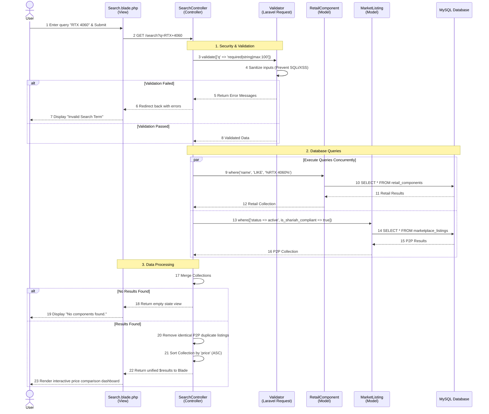
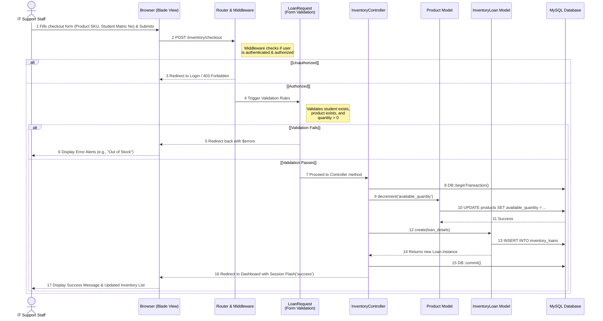
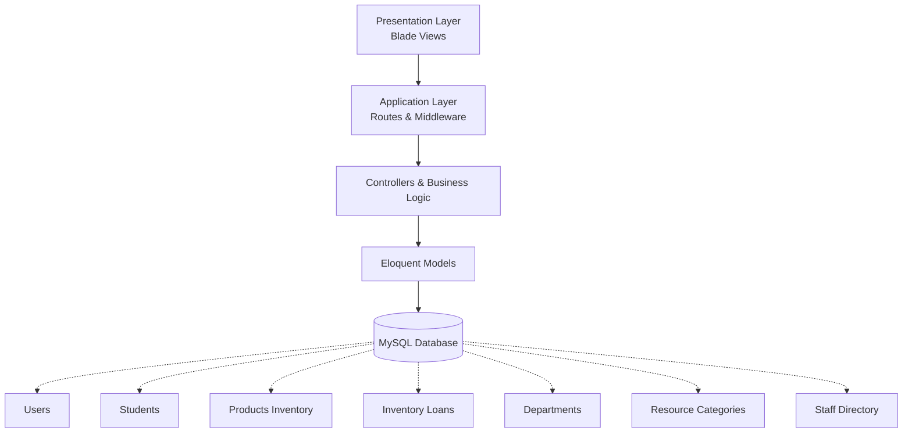

# PROJECT PROPOSAL GUIDELINES 
### BIIT 2305 
### PROPOSAL FOR PROJECT DEVELOPMENT 
### RigRadar: Centralized PC Component Locator & Marketplace 
### GROUP 2 

| NAME | MATRIC NO. |
| :--- | :--- |
| HARITS DANISH BIN MOHD FAIRUZ | 2417417 | 
| DANISH ISKANDAR BIN MUHAMMAD ANNUAR | 2418095 | 
| MOHAMAD AZRELL HAFIZY BIN A HAMID | 2418013 | 
| MOHAMAD AFFIF AFIQ BIN MOHD AFFENDI | 2415445 | 
| DANIEL HAQIMI BIN MUHAMAD KAMAL | 2318163 | 

---

## PROPOSAL FOR PROJECT DEVELOPMENT 

### 1.1 INTRODUCTION
The proposed project is a web-based application, RigRadar, developed using the Laravel Model-View-Controller (MVC) framework.  RigRadar is a centralized hardware aggregator designed specifically for the niche market of PC builders, hardware enthusiasts, and gamers.  The application's criteria include a centralized dashboard featuring a cross-retailer search engine, dynamic price comparison, and a peer-to-peer (P2P) secondhand marketplace.  The system features full CRUD (Create, Read, Update, Delete) capabilities, allowing users to manage their marketplace listings, alongside an integrated search function to locate PC components effectively across multiple official retailers. 

### 1.2 PROBLEM DESCRIPTION

**1.2.1 Background of the problem** 
The application will be developed and deployed as a web application.  Currently, consumers looking to build or upgrade a PC must manually search across fragmented platforms.  They are forced to visit individual official retailer websites (such as All IT Hypermarket, Harvey Norman, and TMT) to check component availability and pricing.  This environment leads to inefficient data retrieval and a highly frustrating consumer experience when comparing prices.  Furthermore, if users want to buy or sell used parts, they must navigate to entirely separate platforms (like eBay or local forums) that lack integration with official retail pricing. 

**1.2.2 Problem Statement** 
The specific problems with existing consumer processes that this application will automate and enhance include: 
* Fragmented searching requires users to manually switch between multiple disconnected retailer websites to compare prices. 
* Lack of a centralized platform makes it difficult to search for specific hardware models, check real-time stock, and find the closest physical store locations quickly. 
* There is no unified platform that allows consumers to survey official brand-new retail prices and local secondhand marketplace listings simultaneously. 

### 1.3 PROJECT OBJECTIVE
The primary objective is to develop a unified web application that streamlines PC component surveying and purchasing under a single dashboard. 
* **Reports Produced:** At the end of the project, the system will produce consolidated view reports (data tables) of searched hardware, displaying aggregated pricing and availability from partnered retailers and user listings. 
* **Processes Automated:** The processes that will be automated include real-time search functionality to filter hardware data, seamless CRUD operations for users to manage their P2P marketplace listings, and automated sorting algorithms that compare prices across different vendors. 

### 1.4 PROJECT SCOPE

**1.4.1 Scope** 
The scope of RigRadar covers the backend database management and frontend user interface for three main operational modules: the Cross-Retailer Search Engine, the Price Comparison Module, and the Peer-to-Peer Marketplace Inventory. 

**1.4.2 Targeted User** 
The target users encompass PC builders, hardware enthusiasts, and gamers looking to source components, as well as private sellers looking to trade in or sell their used PC parts. 

**1.4.3 Specific Platform** 
The infrastructure required for development and execution involves XAMPP (Apache web server and MySQL database via phpMyAdmin) acting as the local server environment.  The application is built on the Laravel PHP framework utilizing Tailwind CSS for the frontend.  Because the project relies entirely on open-source web technologies, there are no specific hardware limitations;  users only require a standard web browser to access the system. 

### 1.5 CONSTRAINTS
The major constraints foreseen for this project development include: 
* **Time constraints:** The development, testing, and debugging phases must be rigorously scheduled to ensure completion within the academic semester timeline. 
* **Technical Learning Curve:** Adapting to Laravel's MVC architecture, mastering complex database queries for the search aggregator, and handling Tailwind CSS compilation requires significant initial research and troubleshooting. 

### 1.6 PROJECT STAGES
The major milestones for the project development are as follows: 
* **Phase 1:** Project Proposal & Requirements Gathering. 
* **Phase 2:** Database Design & Migrations (Structuring Users, Retailers, and Component Listings tables). 
* **Phase 3:** MVC Backend Setup (Establishing Models, Routing, and Resource Controllers). 
* **Phase 4:** Frontend Interface Development (Blade views, Forms, Dashboard integration). 
* **Phase 5:** System Testing (Validating search functionality, sorting algorithms, error handling, and finalizing the project report). 

### 1.7 SIGNIFICANCE OF THE PROJECT
The benefits of this project for the targeted users include: 
* **Consumers/Buyers:** Greatly reduces the time and effort required to build a PC by centralizing price comparisons and stock availability into a single, easily navigable digital dashboard. 
* **Private Sellers:** Provides a dedicated, niche marketplace to list used components directly alongside retail prices, ensuring fair market value and visibility among targeted enthusiasts. 

### 1.8 FEATURES AND FUNCTIONALITIES
Based on the project requirements and RigRadar proposal, here are the core features and functionalities: 
* **Centralized Hardware Dashboard:** The system provides a single, unified interface for users to search for PC components without switching between disconnected retail systems. 
* **Cross-Retailer Search Functionality:** The system features real-time search capabilities to quickly filter hardware data and locate specific models across different official stores. 
* **Dynamic Price Comparison:** Automated comparison tables that rank components by price and highlight real-time stock availability. 
* **P2P Marketplace Module:** Users can perform complete CRUD (Create, Read, Update, Delete) operations to digitally manage and maintain their own secondhand part listings. 
* **Secure User Authentication (Consumers & Sellers):** The application features a secure user login system to ensure that PC builders and hardware enthusiasts can safely manage their personal profiles, price-comparison wishlists, and secondhand marketplace inventory. 
* **Automated Database Validation:** To ensure high data integrity across both the official retail aggregator and the P2P marketplace, the system utilizes strict validation rules.  These rules automatically trigger error alerts and prevent duplicate entries, such as identical secondhand listing submissions by a user or duplicate retail SKU (Stock Keeping Unit) registrations. 
* **Secure Administrative Access:** A strict, role-based authentication portal ensures that only authorized retail partners and system administrators can access, manage, and modify official store inventories and overarching platform data. 
* **Shariah-Compliant E-Commerce Practices:** All features, marketplace interactions, and data management practices will be developed in accordance with Shariah principles.  This includes enforcing transparent price comparisons without hidden fees or deception (Gharar), prohibiting the trade of stolen or illicit hardware in the P2P market, and maintaining fair, ethical peer-to-peer trading guidelines. 

#### 1.8.1 Entity-Relationship Diagram (ERD) 

#### 1.8.2 Activity Sequence Diagram 

### 1.9 SUMMARY
In summary, RigRadar is a comprehensive MVC-based web application engineered to solve the inefficiencies of fragmented PC hardware sourcing.  By unifying cross-retailer search capabilities, dynamic price comparisons, and a secure, Shariah-compliant peer-to-peer marketplace into a single intuitive dashboard, the platform empowers enthusiasts to make data-driven purchasing decisions.  Ultimately, RigRadar streamlines the component sourcing process, ensures high data integrity through strict system validation, and provides a transparent, localized, and highly efficient e-commerce experience for both consumers and private sellers. 

### 2.0 REFERENCES
1. Apache Friends. (n.d.). XAMPP installers and downloads. Retrieved from https://www.apachefriends.org 
2. Mozilla. (n.d.). MVC - MDN Web Docs Glossary. Retrieved from https://developer.mozilla.org/en-US/docs/Glossary/MVC 
3. OpenJS Foundation. (n.d.). Node.js documentation. Retrieved from https://nodejs.org/en/docs/ 
4. Oracle Corporation. (n.d.). MySQL documentation. Retrieved from https://dev.mysql.com/doc/ 
5. The PHP Group. (n.d.). PHP: Hypertext Preprocessor documentation. Retrieved from https://www.php.net/docs.php 
6. Laravel. (n.d.). Laravel Documentation. Retrieved from https://laravel.com/docs 
7. Tailwind Labs. (n.d.). Tailwind CSS Documentation. Retrieved from https://tailwindcss.com/docs 

---

# INTERNATIONAL ISLAMIC UNIVERSITY MALAYSIA (IIUM)
## KULLIYYAH OF INFORMATION TECHNOLOGY AND COMMUNICATION

**WEB APPLICATION DEVELOPMENT (BIIT 2305)** **SEMESTER II, 2025/2026** **SECTION 3**

**TOPIC:** RIGRADAR: CENTRALIZED PC COMPONENT LOCATOR & MARKETPLACE  
**INSTRUCTOR:** DR. NAJHAN BIN MUHAMAD IBRAHIM  
**GITHUB REPOSITORY:** https://github.com/ColonizerFx/RigRadarProject  

| NAME | MATRIC NUMBER |
| :--- | :--- |
| HARITS DANISH BIN MOHD FAIRUZ | 2417417 |
| DANISH ISKANDAR BIN MUHAMMAD ANNUAR | 2418095 |
| MOHAMAD AZRELL HAFIZY BIN A HAMID | 2418013 |
| MOHAMAD AFFIF AFIQ BIN MOHD AFFENDI | 2415445 |
| DANIEL HAQIMI BIN MUHAMAD KAMAL | 2318163 |

---

## 1.0 EXECUTIVE SUMMARY

### 1.1 Project Overview
RigRadar is a comprehensive, web-based centralized hardware aggregator tailored for PC builders, hardware enthusiasts, and gamers. Developed utilizing the Laravel Model-View-Controller (MVC) framework and Tailwind CSS, the platform bridges the gap between fragmented official retail stores and local secondhand markets. It provides a unified dashboard featuring a cross-retailer search engine, dynamic price comparisons, and a secure, Shariah-compliant peer-to-peer (P2P) marketplace.

### 1.2 Objectives Achieved
* Successfully developed a unified web application streamlining PC component surveying.
* Implemented consolidated view reports (data tables) aggregating pricing and stock from partnered retailers and user listings.
* Automated core processes, including real-time cross-retailer search functionality, dynamic price sorting, and seamless CRUD operations for the P2P marketplace.

---

## 2.0 PROBLEM STATEMENT

### 2.1 Problem Background
Consumers building or upgrading PCs traditionally face highly fragmented platforms. To check component pricing and availability, they must manually navigate disconnected retailer websites (e.g., All IT Hypermarket, Harvey Norman, TMT). This results in inefficient data retrieval. Furthermore, the secondhand market exists on entirely separate platforms (like eBay or forums), forcing users to constantly switch contexts to compare new versus used parts.

### 2.2 Problem Statement
* **Fragmented Searching:** Users must manually switch between multiple disconnected retailer websites to compare prices.
* **Lack of Centralization:** There is no unified system to easily search specific hardware models, check real-time stock, and locate physical stores.
* **Disconnected Markets:** No single platform allows consumers to survey official brand-new retail prices and local secondhand listings simultaneously.

### 2.3 Project Objectives
* To develop a centralized platform that aggregates hardware pricing and availability across multiple vendors.
* To provide robust CRUD functionality enabling users to manage their own P2P secondhand listings.
* To integrate automated sorting algorithms that compare and display the most cost-effective options in real-time.

### 2.4 Project Scope
The RigRadar application is designed to include several core features within its current development scope:
* **User Registration and Authentication:** Users, including consumers and sellers, are able to register, log in, and manage their accounts securely through Laravel's built-in authentication system.
* **Marketplace Listing Management (CRUD):** Sellers are able to manage component listings by creating, viewing, updating, and deleting them. Each listing includes details such as title, quantity, price, condition, and location.
* **Cross-Retailer Search & Comparison:** Consumers can search all available parts, apply filters based on category or location, and compare official retail prices with P2P used prices.
* **Role-Based Access Control (RBAC):** The system separates users to ensure that each user only has access to features relevant to their role.

---

## 3.0 SYSTEM DESIGN
### 3.1 Entity Relationship Diagram (ERD)

### 3.2 System Sequence Diagram

### 3.3 System Architecture Overview

The Inventory Management System is developed using a three-tier architecture based on the Laravel MVC (Model-View-Controller) framework. The presentation layer consists of Blade Views that provide interfaces for IT support staff to manage students, inventory items, and loan transactions. User requests are processed through the routing and middleware layer, which handles authentication, authorization, and request validation. The controller layer contains the business logic responsible for inventory management and loan processing. Models interact with the MySQL database to perform data storage and retrieval operations. The system ensures data consistency through validation rules and database transactions, particularly during inventory checkout processes where product availability and loan records must be updated simultaneously. This architecture promotes maintainability, scalability, security, and clear separation of concerns between system components.

## 4.0 TECHNICAL IMPLEMENTATION
### 4.1 Models & Database Migrations
The platform is structured around several primary Eloquent models: `User`, `MarketplaceListing`, `RetailComponent`, and `Category`. The `User` model serves as the base, extending Authenticatable. It is designed to store important profile details and manage relationships to the `MarketplaceListing` items. The `MarketplaceListing` model acts as the central hub for P2P inventory. It monitors essential item information, such as title, description, asking price, pickup location, image, and the current status. This model maintains a `belongsTo` connection to both the `User` and `Category` models.

### 4.2 Routes Configuration
Routes in RigRadar are categorized into organized groups located in `routes/web.php` utilizing route prefixes and middleware grouping:

- **Public routes:** The landing page (`/`) and core marketplace search views (`/search`) are accessible to all visitors without authentication.
- **Auth routes:** Registration (`/register`) and login (`/login`) are handled by Laravel's default authentication scaffolding and are protected by the guest middleware.
- **Protected User routes:** Utilizing auth middleware, these routes (`/dashboard`, `/listings/create`) allow authenticated buyers and sellers to interact with listings, chat with users, and manage their personal inventory securely.
- **Admin routes:** Guarded by a custom `role:admin` middleware, protecting the `/admin` prefix from standard consumer access.

### 4.3 Controllers & CRUD Logic
The PageController handles standard page display operations. When an authenticated user wants to add an item to the marketplace, the logic ensures that the incoming request data is checked for validity using Laravel's integrated validation. Required fields include title, price, and location. When an image is uploaded, it gets saved in the public storage folder using Laravel Storage.

### 4.4 User Authentication & Security
The authentication system utilizes standard Laravel session-based auth. Role-based logic ensures strict security. The registration process verifies inputs before the user is persisted to the database with a hashed password generated by Hash::make().

### 4.5 Views & Blade Template Engine
All views in RigRadar are based on a main layout specified in Blade. This structure fetches shared assets: Google Fonts, Tailwind CSS via Vite, and interactive components. Child views extend the layout and inject their content into named sections ensuring a consistent header, navbar, and footer across all pages with no code duplication.

## 5.0 USER INTERFACE DESIGN

The user interface of RigRadar was developed with a strong emphasis on a minimalist and clean UI design, ensuring that users can navigate the platform without feeling overwhelmed by technical clutter. Utilizing Tailwind CSS, the interface maintains a consistent, modern aesthetic that prioritizes readability, accessibility, and straightforward navigation.

### 5.1 Use of Media (20 marks)

**5.1.1 Find your Parts page**

**Figure 5.1.1 (Find your Parts page):** Media is utilized strategically to support the purchasing process rather than distract from it. High-quality, uniformly sized product images are displayed in a structured grid format, allowing users to quickly identify hardware components. Discount tags (e.g., "3% OFF") are positioned prominently on the product cards, utilizing contrasting colors to immediately draw the user's eye to potential savings without disrupting the overall clean layout.

### 5.2 Design, Colour Scheme & Layout (20 marks)

**5.2.1 Hero Banner**

**Figure 5.2.1 (Hero Banner):** The platform adopts a high-contrast yet friendly color scheme. A predominantly white and light-gray background minimizes visual noise, while a distinct primary blue is used for critical call-to-action (CTA) buttons, interactive elements, and branding. The Hero Banner utilizes a dark, immersive background image to create visual depth, paired with bold, white typography to ensure the main value proposition ("Complete Your Setup") is immediately legible. The layout leverages responsive CSS grids to ensure components align perfectly across different screen sizes.

### 5.3 Navigation & Links (10 marks)

**5.3.1 User Dashboard**

**Figure 5.3.1 (User Dashboard):** Navigation is designed to be intuitive and flat. The persistent top navigation bar provides immediate access to core modules: Find your Parts, Devices, PC Builder, and the User Marketplace. In the User Dashboard, information is segmented into distinct, readable cards ("Transaction History," "My Marketplace Listings," and "My Wishlist"). This compartmentalized approach prevents cognitive overload, allowing users to manage their P2P listings and track orders efficiently from a single, unified view.

### 5.4 UI Walkthrough (Page by Page)

**5.4.1 Marketplace Item Listing**

**Figure 5.4.1 (Marketplace Item Listing):** The form layout for selling items is straightforward, utilizing clean input fields and clear dropdown menus for "Category" and "Condition". The prominent "Upload Image" utility ensures that user-generated P2P listings maintain a standard of visual quality.

**5.4.2 User Marketplace page**

**Figure 5.4.2 (User Marketplace Page):** This page functions as the public peer-to-peer (P2P) storefront where all community listings are aggregated. The interface utilizes a multi-layered filtering sidebar that allows users to sort available secondhand hardware by Category, Condition (e.g., "New Open Box", "Good Like New"), and Location. Listings are presented in a clean responsive grid. Each product card clearly demarcates the asking price, product title, and dynamic contextual call-to-action (CTA) buttons, such as "Chat with Seller" or a "Your Listing" tag if the authenticated user is the owner of that post. This ensures a streamlined browsing experience that keeps community commerce organized and easy to parse.

**5.4.3 Search bar**

**Figure 5.4.3 (Search Results Page):** The search results page serves as the primary dynamic interface that populates immediately after a user inputs a query into the centralized search bar. Adhering to the platform's minimalist design philosophy, the layout uses a structured grid system to display matching components, minimizing visual clutter so users can compare options efficiently. Each product card within the results grid displays key high-level data points: the component's name, an aggregated price range from various Malaysian retailers, and a clean thumbnail image. This page works in tandem with the filtering sidebar, allowing the results to update dynamically as the user narrows down hardware by brand, price range, or category, all while preserving generous whitespace and a clean, highly legible presentation.

**5.4.4 Searching results**

**Figure 5.4.4 (Searching):** The centralized search bar is positioned at the top of the hierarchy, reflecting its importance as the primary tool for navigating fragmented hardware markets. Filtering options (Category, Brands, Retailer) are presented horizontally, preserving vertical space for the search results.

**5.4.5 Devices page**

**Figure 5.4.5 (Product Details Page):** This page provides a comprehensive breakdown of a selected hardware component, emphasizing structural data hierarchy and immediate price transparency. The interface utilizes an asymmetrical two-column responsive grid layout. The left column focuses entirely on high-fidelity product imagery to give users a clear visual evaluation of the component. The right column centralizes transactional and analytical data, including the product title, overall user ratings, and a clear, real-time price comparison table that aggregates offers across different Malaysian retail partners. Technical specifications are neatly partitioned into an interactive tab or accordion format further down the page, preserving clean whitespace and preventing cognitive overload from dense hardware specs. A prominent, primary blue "Add to Cart" or "Add to PC Build" CTA button sits at the top of the interaction hierarchy, providing a frictionless path to purchase or system configuration.

**5.4.6 PC Builder page**

**Figure 5.4.6 (PC Builder):** This page breaks down the complex task of building a PC into a guided, step-by-step process. Each component category (CPU, GPU, Motherboard, etc.) features a dedicated selection dropdown, with a sticky "Build Summary" providing real-time cost tracking.

**5.4.7 Cart page**

**Figure 5.4.7 (Cart Page):** The cart page acts as a centralized validation checkpoint where users review selected hardware components before completing a purchase. The interface aggregates items dynamically into an open vertical stream, clearly breaking down product details, itemized pricing, and explicit retailer attributions (e.g., TMT, All IT Hypermarket) to preserve transparency. To prevent information fragmentation, a sticky "Order Summary" panel balances the layout on the right, providing a high-visibility breakdown of total costs (e.g., "RM 7,374.00") and a prominent primary "Proceed to Checkout" CTA button. This layout structure minimizes navigation friction, allowing users to make instantaneous alterations without losing context.

**5.4.8 Checkout page**

**Figure 5.4.8 (Checkout Page):** The checkout page is built around minimizing transaction anxiety through strict data structural clarity. By stripping away non-essential layout details like standard retail carousels and promotional sidebars, the clean layout ensures complete focus on fulfillment verification. The responsive grid partitions the view into interactive delivery form structures and a static billing summary. This streamlined setup guides the user sequentially through final order parameters, promoting a fast, reliable, and user-centric final step in the component procurement process.

**5.4.9 About us page**

**Figure 5.4.9 (About Us Page):** Shifting from transactional logic to brand identity, the About Us page relies on strong typographic hierarchy and clean whitespace to convey RigRadar's core mission. Utilizing generous spacing and structural layout grids, the page articulates the platform's vision of solving market fragmentation without cluttering the user interface. This approach builds platform trust and highlights the community-driven aspect of the integrated peer-to-peer marketplace, matching the modern, minimalist design aesthetic found across the application.

**5.4.10 Contact Us page**

**Figure 5.4.10 (Contact Us Page):** The Contact Us page provides a structured touchpoint for user inquiries, marketplace support, and platform feedback while strictly adhering to the application's minimalist design language. The interface features a balanced, responsive two-column layout. The left column presents a clean communication form with well-spaced input fields (such as Name, Email, Subject, and Message) that offer clear visual feedback upon interaction. The right column houses direct platform support channels and essential operational details, using distinct typography hierarchies to keep information highly scannable. By removing excessive visual clutter and utilizing a prominent, primary blue "Send Message" CTA button, the page ensures a frictionless and straightforward experience for users seeking technical assistance or reporting marketplace concerns.

**5.4.11 Messages page**

**5.4.12**

**Figure 5.4.11 & 5.4.12 (Messaging):** To facilitate the P2P marketplace, the messaging interface adopts a familiar, modern chat bubble layout. This clean execution ensures that buyer-seller negotiations are organized and easily scannable.

**5.4.13 User Dashboard**

**Figure 5.4.13 (User Dashboard):** The user dashboard functions as a personalized workspace where authenticated users can comprehensively oversee their platform interactions. Following the application's clean, minimalist architectural language, the responsive interface organizes user data into three modular, high-contrast panels: Transaction History, My Marketplace Listings, and My Wishlist. The _Transaction History_ section provides structural transparency by logging previous order details and their specific fulfillment statuses (e.g., "Completed"). The _My Marketplace Listings_ container grants instantaneous access to listing controls, allowing users to perform seamless CRUD updates (editing or deleting items) or initiate a new post using the high-visibility "Sell New Item" CTA button. Lastly, the _My Wishlist_ section dynamically gathers bookmarked hardware components for rapid future retrieval. This design configuration consolidates administrative features into a single grid, reducing user friction and ensuring an intuitive management experience.

## 6.0 SYSTEM TESTING
### 6.1 Test Cases Table

| Test No. | Feature Tested | Test Input | Expected Result | Actual Result | Status |
|---|---|---|---|---|---|
| T-01 | User Registration | Valid registration details | User account is successfully created and redirected to the appropriate dashboard. | Account was created successfully and user was redirected to the dashboard. | PASS |
| T-02 | User Authentication (Login) | Valid login credentials | System authenticates the user, initializes a secure session, and grants access to the dashboard. | User was authenticated successfully and granted access to the system. | PASS |
| T-03 | Search Functionality | Valid search keyword | System retrieves and displays items matching the search criteria. | Relevant items were displayed correctly based on the search query. | PASS |
| T-04 | Image Upload | Valid image file | Image is uploaded successfully, stored in the public directory, and its path is recorded in the database. | Image was uploaded, stored correctly, and displayed as expected. | PASS |
| T-05 | Mobile Responsiveness | Browser resized to mobile dimensions | Layout adapts responsively, with components stacking appropriately for smaller screens. | Interface remained functional, and all elements were displayed correctly on mobile view. | PASS |

## 7.0 CHALLENGES AND SOLUTIONS

### 7.1 Technical Challenges

1. **Data Aggregation:**
   One of the main technical challenges was integrating data from official retail inventories and user-generated marketplace listings into a single, unified platform. This required careful database design to ensure data consistency and efficient retrieval. The issue was resolved by implementing separate database schemas and leveraging Laravel's Eloquent ORM relationships to manage and query related data effectively.

2. **Image Storage and Linking Issues:**
   During the initial development phase, uploaded images were not displayed correctly due to storage path configuration issues. This challenge was addressed by properly configuring Laravel's file storage system and executing the `php artisan storage:link` command to establish the required symbolic link between the storage and public directories.

### 7.2 Team & Time Constraints

1. **Accelerated Development Timeline:**
   The limited development period was a significant constraint throughout the project. To ensure timely completion, the team adopted an Agile development approach and prioritized essential functionalities such as user authentication, CRUD operations, and product browsing, while postponing non-critical features for future enhancement.

2. **Managing Diverse Technical Skill Sets:**
   The team consisted of members with varying levels of experience in Laravel and PHP development. To overcome this challenge, collaborative practices such as pair programming, knowledge sharing sessions, and code reviews were implemented. These approaches improved team coordination, enhanced technical understanding, and ensured consistent progress throughout the project.

## 8.0 CONCLUSION
### 8.1 Summary of Achievements

The RigRadar project has successfully delivered a centralized and user-friendly web application developed using the Laravel MVC framework. The platform addresses the challenges of sourcing PC components by providing a structured marketplace that connects users with both official retail products and community-listed items through a single interface.

The project successfully implemented a multi-role user architecture, ensuring secure access and personalized functionality for different user groups. Buyers benefit from real-time access to product listings, enabling more informed purchasing decisions without relying on fragmented information sources. Supported by an optimized MySQL database and Laravel's robust architecture, RigRadar provides an efficient, scalable, and reliable platform that promotes transparency and aligns with Shariah-compliant e-commerce principles.

### 8.2 Future Improvements

To further enhance the functionality, scalability, and user experience of RigRadar, several improvements are proposed for future development:

1. **Integrated Secure Payment Gateway:**
   Integration of third-party payment services such as ToyyibPay or Stripe would enable users to complete transactions directly within the platform, providing a more seamless and secure purchasing experience.

2. **Real-Time In-App Chat System:**
   A real-time messaging feature powered by technologies such as Laravel Reverb or Pusher could facilitate direct communication between buyers and sellers, improving negotiation and transaction efficiency.

3. **Cross-Platform Mobile Application:**
   Developing a mobile application using frameworks such as Flutter or React Native would improve accessibility and allow users to receive instant notifications regarding new listings, price changes, and marketplace updates.

4. **Advanced Product Search and Filtering:**
   Enhanced search capabilities, including filtering by component type, brand, price range, and specifications, would help users locate suitable PC parts more efficiently.

5. **Wishlist and Price Alert Features:**
   Users could save products of interest and receive notifications when prices change or when desired items become available, improving engagement and user satisfaction.

## REFERENCES
1. Apache Friends. (n.d.). XAMPP installers and downloads. Retrieved from https://www.apachefriends.org 
2. Mozilla. (n.d.). MVC - MDN Web Docs Glossary. Retrieved from https://developer.mozilla.org/en-US/docs/Glossary/MVC 
3. OpenJS Foundation. (n.d.). Node.js documentation. Retrieved from https://nodejs.org/en/docs/ 
4. Oracle Corporation. (n.d.). MySQL documentation. Retrieved from https://dev.mysql.com/doc/ 
5. The PHP Group. (n.d.). PHP: Hypertext Preprocessor documentation. Retrieved from https://www.php.net/docs.php 
6. Laravel. (n.d.). Laravel Documentation. Retrieved from https://laravel.com/docs 
7. Tailwind Labs. (n.d.). Tailwind CSS Documentation. Retrieved from https://tailwindcss.com/docs 
