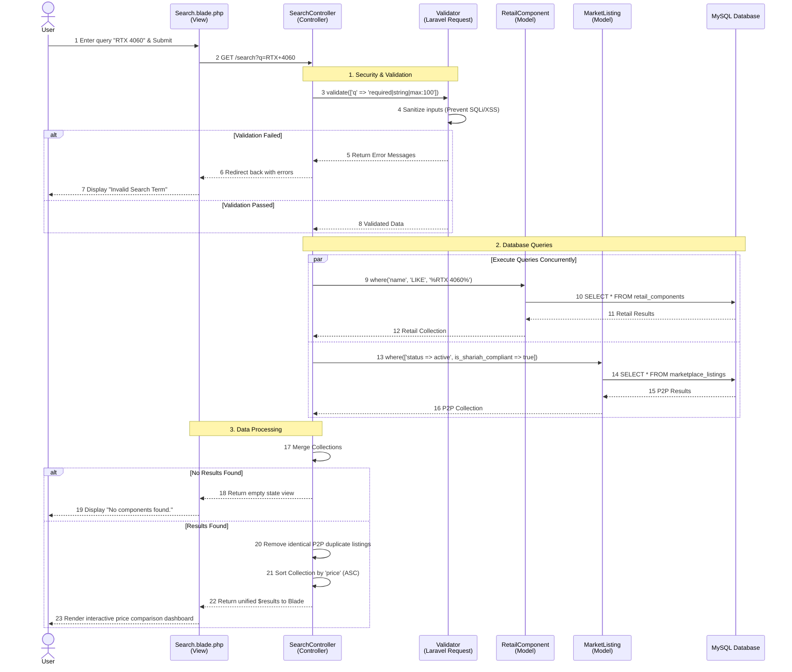
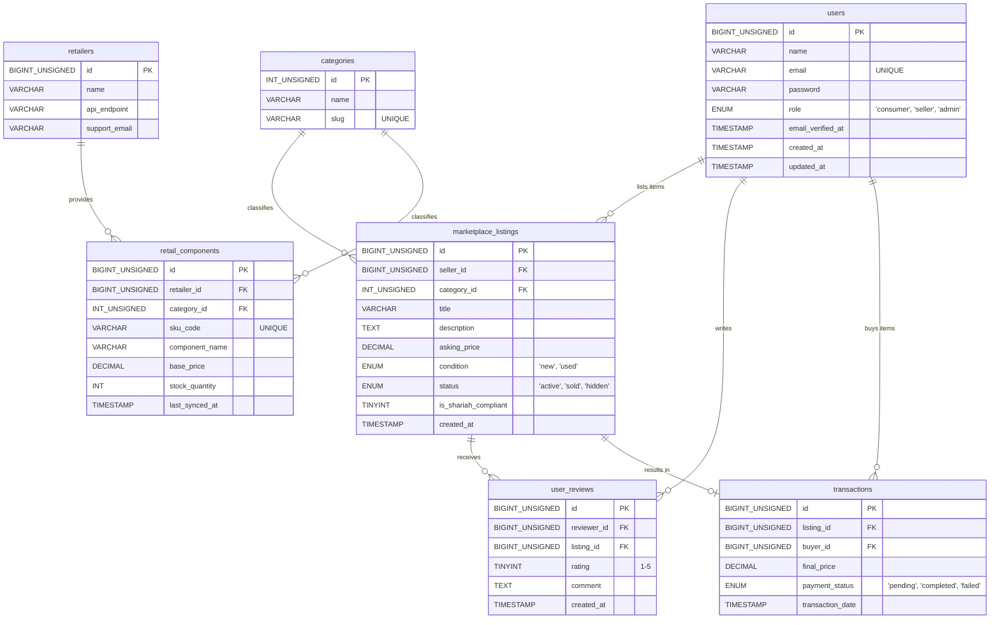
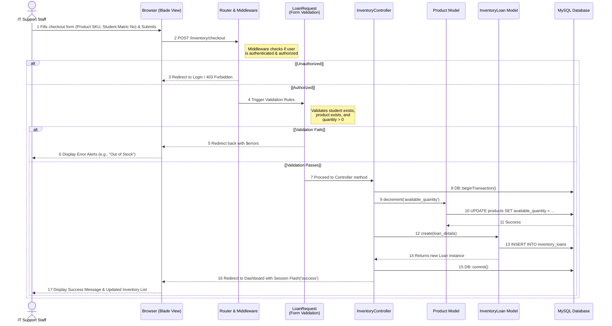
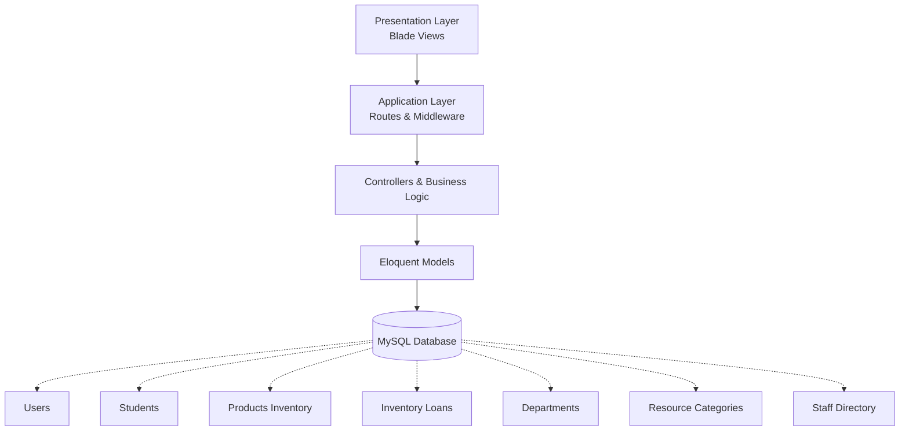

# PROJECT PROPOSAL GUIDELINES 
### BIIT 2305 
### PROPOSAL FOR PROJECT DEVELOPMENT 
### RigRadar: Centralized PC Component Locator & Marketplace 
### GROUP 2 

| NAME | MATRIC NO. |
| :--- | :--- |
| HARITS DANISH BIN MOHD FAIRUZ | 2417417 | 
| DANISH ISKANDAR BIN MUHAMMAD ANNUAR | 2418095 | 
| MOHAMAD AZRELL HAFIZY BIN A HAMID | 2418013 | 
| MOHAMAD AFFIF AFIQ BIN MOHD AFFENDI | 2415445 | 
| DANIEL HAQIMI BIN MUHAMAD KAMAL | 2318163 | 

---

## PROPOSAL FOR PROJECT DEVELOPMENT 

### 1.1 INTRODUCTION
The proposed project is a web-based application, RigRadar, developed using the Laravel Model-View-Controller (MVC) framework.  RigRadar is a centralized hardware aggregator designed specifically for the niche market of PC builders, hardware enthusiasts, and gamers.  The application's criteria include a centralized dashboard featuring a cross-retailer search engine, dynamic price comparison, and a peer-to-peer (P2P) secondhand marketplace.  The system features full CRUD (Create, Read, Update, Delete) capabilities, allowing users to manage their marketplace listings, alongside an integrated search function to locate PC components effectively across multiple official retailers. 

### 1.2 PROBLEM DESCRIPTION

**1.2.1 Background of the problem** 
The application will be developed and deployed as a web application.  Currently, consumers looking to build or upgrade a PC must manually search across fragmented platforms.  They are forced to visit individual official retailer websites (such as All IT Hypermarket, Harvey Norman, and TMT) to check component availability and pricing.  This environment leads to inefficient data retrieval and a highly frustrating consumer experience when comparing prices.  Furthermore, if users want to buy or sell used parts, they must navigate to entirely separate platforms (like eBay or local forums) that lack integration with official retail pricing. 

**1.2.2 Problem Statement** 
The specific problems with existing consumer processes that this application will automate and enhance include: 
* Fragmented searching requires users to manually switch between multiple disconnected retailer websites to compare prices. 
* Lack of a centralized platform makes it difficult to search for specific hardware models, check real-time stock, and find the closest physical store locations quickly. 
* There is no unified platform that allows consumers to survey official brand-new retail prices and local secondhand marketplace listings simultaneously. 

### 1.3 PROJECT OBJECTIVE
The primary objective is to develop a unified web application that streamlines PC component surveying and purchasing under a single dashboard. 
* **Reports Produced:** At the end of the project, the system will produce consolidated view reports (data tables) of searched hardware, displaying aggregated pricing and availability from partnered retailers and user listings. 
* **Processes Automated:** The processes that will be automated include real-time search functionality to filter hardware data, seamless CRUD operations for users to manage their P2P marketplace listings, and automated sorting algorithms that compare prices across different vendors. 

### 1.4 PROJECT SCOPE

**1.4.1 Scope** 
The scope of RigRadar covers the backend database management and frontend user interface for three main operational modules: the Cross-Retailer Search Engine, the Price Comparison Module, and the Peer-to-Peer Marketplace Inventory. 

**1.4.2 Targeted User** 
The target users encompass PC builders, hardware enthusiasts, and gamers looking to source components, as well as private sellers looking to trade in or sell their used PC parts. 

**1.4.3 Specific Platform** 
The infrastructure required for development and execution involves XAMPP (Apache web server and MySQL database via phpMyAdmin) acting as the local server environment.  The application is built on the Laravel PHP framework utilizing Tailwind CSS for the frontend.  Because the project relies entirely on open-source web technologies, there are no specific hardware limitations;  users only require a standard web browser to access the system. 

### 1.5 CONSTRAINTS
The major constraints foreseen for this project development include: 
* **Time constraints:** The development, testing, and debugging phases must be rigorously scheduled to ensure completion within the academic semester timeline. 
* **Technical Learning Curve:** Adapting to Laravel's MVC architecture, mastering complex database queries for the search aggregator, and handling Tailwind CSS compilation requires significant initial research and troubleshooting. 

### 1.6 PROJECT STAGES
The major milestones for the project development are as follows: 
* **Phase 1:** Project Proposal & Requirements Gathering. 
* **Phase 2:** Database Design & Migrations (Structuring Users, Retailers, and Component Listings tables). 
* **Phase 3:** MVC Backend Setup (Establishing Models, Routing, and Resource Controllers). 
* **Phase 4:** Frontend Interface Development (Blade views, Forms, Dashboard integration). 
* **Phase 5:** System Testing (Validating search functionality, sorting algorithms, error handling, and finalizing the project report). 

### 1.7 SIGNIFICANCE OF THE PROJECT
The benefits of this project for the targeted users include: 
* **Consumers/Buyers:** Greatly reduces the time and effort required to build a PC by centralizing price comparisons and stock availability into a single, easily navigable digital dashboard. 
* **Private Sellers:** Provides a dedicated, niche marketplace to list used components directly alongside retail prices, ensuring fair market value and visibility among targeted enthusiasts. 

### 1.8 FEATURES AND FUNCTIONALITIES
Based on the project requirements and RigRadar proposal, here are the core features and functionalities: 
* **Centralized Hardware Dashboard:** The system provides a single, unified interface for users to search for PC components without switching between disconnected retail systems. 
* **Cross-Retailer Search Functionality:** The system features real-time search capabilities to quickly filter hardware data and locate specific models across different official stores. 
* **Dynamic Price Comparison:** Automated comparison tables that rank components by price and highlight real-time stock availability. 
* **P2P Marketplace Module:** Users can perform complete CRUD (Create, Read, Update, Delete) operations to digitally manage and maintain their own secondhand part listings. 
* **Secure User Authentication (Consumers & Sellers):** The application features a secure user login system to ensure that PC builders and hardware enthusiasts can safely manage their personal profiles, price-comparison wishlists, and secondhand marketplace inventory. 
* **Automated Database Validation:** To ensure high data integrity across both the official retail aggregator and the P2P marketplace, the system utilizes strict validation rules.  These rules automatically trigger error alerts and prevent duplicate entries, such as identical secondhand listing submissions by a user or duplicate retail SKU (Stock Keeping Unit) registrations. 
* **Secure Administrative Access:** A strict, role-based authentication portal ensures that only authorized retail partners and system administrators can access, manage, and modify official store inventories and overarching platform data. 
* **Shariah-Compliant E-Commerce Practices:** All features, marketplace interactions, and data management practices will be developed in accordance with Shariah principles.  This includes enforcing transparent price comparisons without hidden fees or deception (Gharar), prohibiting the trade of stolen or illicit hardware in the P2P market, and maintaining fair, ethical peer-to-peer trading guidelines. 

#### 1.8.1 Entity-Relationship Diagram (ERD) 

#### 1.8.2 Activity Sequence Diagram 

### 1.9 SUMMARY
In summary, RigRadar is a comprehensive MVC-based web application engineered to solve the inefficiencies of fragmented PC hardware sourcing.  By unifying cross-retailer search capabilities, dynamic price comparisons, and a secure, Shariah-compliant peer-to-peer marketplace into a single intuitive dashboard, the platform empowers enthusiasts to make data-driven purchasing decisions.  Ultimately, RigRadar streamlines the component sourcing process, ensures high data integrity through strict system validation, and provides a transparent, localized, and highly efficient e-commerce experience for both consumers and private sellers. 

### 2.0 REFERENCES
1. Apache Friends. (n.d.). XAMPP installers and downloads. Retrieved from https://www.apachefriends.org 
2. Mozilla. (n.d.). MVC - MDN Web Docs Glossary. Retrieved from https://developer.mozilla.org/en-US/docs/Glossary/MVC 
3. OpenJS Foundation. (n.d.). Node.js documentation. Retrieved from https://nodejs.org/en/docs/ 
4. Oracle Corporation. (n.d.). MySQL documentation. Retrieved from https://dev.mysql.com/doc/ 
5. The PHP Group. (n.d.). PHP: Hypertext Preprocessor documentation. Retrieved from https://www.php.net/docs.php 
6. Laravel. (n.d.). Laravel Documentation. Retrieved from https://laravel.com/docs 
7. Tailwind Labs. (n.d.). Tailwind CSS Documentation. Retrieved from https://tailwindcss.com/docs 

---

# INTERNATIONAL ISLAMIC UNIVERSITY MALAYSIA (IIUM)
## KULLIYYAH OF INFORMATION TECHNOLOGY AND COMMUNICATION

**WEB APPLICATION DEVELOPMENT (BIIT 2305)** **SEMESTER II, 2025/2026** **SECTION 3**

**TOPIC:** RIGRADAR: CENTRALIZED PC COMPONENT LOCATOR & MARKETPLACE  
**INSTRUCTOR:** DR. NAJHAN BIN MUHAMAD IBRAHIM  
**GITHUB REPOSITORY:** https://github.com/ColonizerFx/RigRadarProject  

| NAME | MATRIC NUMBER |
| :--- | :--- |
| HARITS DANISH BIN MOHD FAIRUZ | 2417417 |
| DANISH ISKANDAR BIN MUHAMMAD ANNUAR | 2418095 |
| MOHAMAD AZRELL HAFIZY BIN A HAMID | 2418013 |
| MOHAMAD AFFIF AFIQ BIN MOHD AFFENDI | 2415445 |
| DANIEL HAQIMI BIN MUHAMAD KAMAL | 2318163 |

---

## 1.0 EXECUTIVE SUMMARY

### 1.1 Project Overview
RigRadar is a comprehensive, web-based centralized hardware aggregator tailored for PC builders, hardware enthusiasts, and gamers. Developed utilizing the Laravel Model-View-Controller (MVC) framework and Tailwind CSS, the platform bridges the gap between fragmented official retail stores and local secondhand markets. It provides a unified dashboard featuring a cross-retailer search engine, dynamic price comparisons, and a secure, Shariah-compliant peer-to-peer (P2P) marketplace.

### 1.2 Objectives Achieved
* Successfully developed a unified web application streamlining PC component surveying.
* Implemented consolidated view reports (data tables) aggregating pricing and stock from partnered retailers and user listings.
* Automated core processes, including real-time cross-retailer search functionality, dynamic price sorting, and seamless CRUD operations for the P2P marketplace.

---

## 2.0 PROBLEM STATEMENT

### 2.1 Problem Background
Consumers building or upgrading PCs traditionally face highly fragmented platforms. To check component pricing and availability, they must manually navigate disconnected retailer websites (e.g., All IT Hypermarket, Harvey Norman, TMT). This results in inefficient data retrieval. Furthermore, the secondhand market exists on entirely separate platforms (like eBay or forums), forcing users to constantly switch contexts to compare new versus used parts.

### 2.2 Problem Statement
* **Fragmented Searching:** Users must manually switch between multiple disconnected retailer websites to compare prices.
* **Lack of Centralization:** There is no unified system to easily search specific hardware models, check real-time stock, and locate physical stores.
* **Disconnected Markets:** No single platform allows consumers to survey official brand-new retail prices and local secondhand listings simultaneously.

### 2.3 Project Objectives
* To develop a centralized platform that aggregates hardware pricing and availability across multiple vendors.
* To provide robust CRUD functionality enabling users to manage their own P2P secondhand listings.
* To integrate automated sorting algorithms that compare and display the most cost-effective options in real-time.

### 2.4 Project Scope
The RigRadar application is designed to include several core features within its current development scope:
* **User Registration and Authentication:** Users, including consumers and sellers, are able to register, log in, and manage their accounts securely through Laravel's built-in authentication system.
* **Marketplace Listing Management (CRUD):** Sellers are able to manage component listings by creating, viewing, updating, and deleting them. Each listing includes details such as title, quantity, price, condition, and location.
* **Cross-Retailer Search & Comparison:** Consumers can search all available parts, apply filters based on category or location, and compare official retail prices with P2P used prices.
* **Role-Based Access Control (RBAC):** The system separates users to ensure that each user only has access to features relevant to their role.

---

## 3.0 SYSTEM DESIGN
### 3.1 Entity Relationship Diagram (ERD)

### 3.2 System Sequence Diagram

### 3.3 System Architecture Overview

The Inventory Management System is developed using a three-tier architecture based on the Laravel MVC (Model-View-Controller) framework. The presentation layer consists of Blade Views that provide interfaces for IT support staff to manage students, inventory items, and loan transactions. User requests are processed through the routing and middleware layer, which handles authentication, authorization, and request validation. The controller layer contains the business logic responsible for inventory management and loan processing. Models interact with the MySQL database to perform data storage and retrieval operations. The system ensures data consistency through validation rules and database transactions, particularly during inventory checkout processes where product availability and loan records must be updated simultaneously. This architecture promotes maintainability, scalability, security, and clear separation of concerns between system components.

## 4.0 TECHNICAL IMPLEMENTATION
### 4.1 Models & Database Migrations
The platform is structured around several primary Eloquent models: `User`, `MarketplaceListing`, `RetailComponent`, and `Category`. The `User` model serves as the base, extending Authenticatable. It is designed to store important profile details and manage relationships to the `MarketplaceListing` items. The `MarketplaceListing` model acts as the central hub for P2P inventory. It monitors essential item information, such as title, description, asking price, pickup location, image, and the current status. This model maintains a `belongsTo` connection to both the `User` and `Category` models.

### 4.2 Routes Configuration
Routes in RigRadar are categorized into organized groups located in `routes/web.php` utilizing route prefixes and middleware grouping:

- **Public routes:** The landing page (`/`) and core marketplace search views (`/search`) are accessible to all visitors without authentication.
- **Auth routes:** Registration (`/register`) and login (`/login`) are handled by Laravel's default authentication scaffolding and are protected by the guest middleware.
- **Protected User routes:** Utilizing auth middleware, these routes (`/dashboard`, `/listings/create`) allow authenticated buyers and sellers to interact with listings, chat with users, and manage their personal inventory securely.
- **Admin routes:** Guarded by a custom `role:admin` middleware, protecting the `/admin` prefix from standard consumer access.

### 4.3 Controllers & CRUD Logic
The `PageController` handles standard page display operations. When an authenticated user wants to add an item to the marketplace, the logic ensures that the incoming request data is checked for validity using Laravel’s integrated validation. Required fields include title, price, and location. When an image is uploaded, it gets saved in the public storage folder using Laravel Storage. 

### 4.4 User Authentication & Security
The authentication system utilizes standard Laravel session-based auth. Role-based logic ensures strict security. The registration process verifies inputs before the user is persisted to the database with a hashed password generated by `Hash::make()`. 

### 4.5 Views & Blade Template Engine
All views in RigRadar are based on a main layout specified in Blade. This structure fetches shared assets: Google Fonts, Tailwind CSS via Vite, and interactive components. Child views extend the layout and inject their content into named sections ensuring a consistent header, navbar, and footer across all pages with no code duplication.

## 5.0 USER INTERFACE DESIGN
### 5.1 Use of Media (20 marks)
The RigRadar platform incorporates a mix of static and dynamic media:
- **Dynamic Product Images:** Managed natively via Laravel Storage, uploaded food/component images provide buyers with a transparent, realistic view of the item.
- **Categorization Badges:** Utilizing Tailwind classes, listings dynamically pull classification data to display stylized tags.

### 5.2 Design, Colour Scheme & Layout (20 marks)
The user interface design of RigRadar relies on modern UI frameworks:
- **Colour Palette:** Built around a sleek dark mode aesthetic with strong Brand accents (primary greens and blues) to symbolize high-performance technology. 
- **Typography Choices:** The application imports Google Fonts `Inter` to give an elegant, highly legible feel for data-heavy component specifications.
- **Grid Structure:** Built entirely on Tailwind CSS grid and flex systems, the platform utilizes a mobile-first responsive layout. Content hierarchy is cleanly segmented.

### 5.3 Navigation & Links (10 marks)
The navigation layout is controlled globally. It utilizes Laravel Blade directives (`@auth`, `@guest`) to dynamically change the UI according to the user's session state. Guest modes display simple call-to-action login buttons, while authenticated modes provide access to personalized dashboard controls.

### 5.4 UI Walkthrough (Page by Page)
- **Landing Page:** Features a welcoming hero slider built with a bold headline framing the app's mission. It includes direct call-to-action links to register or browse the marketplace immediately.
- **Marketplace Feed:** An active interface utilizing a dynamic `@forelse` loop. It displays all listings via interactive cards complete with location descriptions and pricing.
- **Details Page:** A secure summary view showing the item's details, pickup conditions, seller profile information, and a primary call to action to contact the seller.

## 6.0 SYSTEM TESTING
### 6.1 Test Cases Table

| Test No. | Feature Tested | Test Input | Expected Result | Actual Result | Status |
|---|---|---|---|---|---|
| T-01 | User Registration | Valid details | Account created; redirected to Dashboard. | Account created smoothly. | PASS |
| T-02 | Auth Login | Correct credentials | Application initializes session ID; safely logs user in. | Authenticated successfully. | PASS |
| T-03 | Search Feed | Search string | System queries available items, matching string. | Items displayed correctly. | PASS |
| T-04 | Image Upload | Valid Image File | Image stored in public storage; DB inserts path. | Image saved and rendered. | PASS |
| T-05 | Mobile Responsiveness | Resizing browser | Grid layout stacks vertically using flex properties. | Elements wrap cleanly; functional. | PASS |

### 6.2 Deployment Verification
The application has been engineered to support cloud deployment. The live environment connects seamlessly to a cloud-hosted MySQL database instance. Critical production parameters configured within the environment variable engine include `APP_ENV=production` and `DB_HOST` variables mapping to the production schema.

## 7.0 CHALLENGES AND SOLUTIONS
### 7.1 Technical Challenges
- **Data Aggregation:** Merging data from separate official retail inventories and user marketplace listings into a unified view required careful data structuring. Resolved by creating distinct database schemas and utilizing Laravel's Eloquent relationships to neatly query them.
- **Image Linking Errors:** In the early development phase, images were broken due to storage issues. Resolved by properly configuring and executing the `php artisan storage:link` command.

### 7.2 Team & Time Constraints
- **Accelerated Development Timeline:** The tight schedule was our main limitation. To manage this, we implemented an Agile approach, focusing on the ‘must have’ features (Authentication, CRUD, and Browsing) instead of secondary features.
- **Managing Diverse Technical Skill Sets:** Our team consisted of members with varying levels of proficiency in Laravel and PHP development. We addressed this through pair programming and collaborative code reviews.

## 8.0 CONCLUSION
### 8.1 Summary of Achievements
The RigRadar project has successfully delivered a robust, centralized web application built on the Laravel MVC framework tailored specifically toward mitigating the compounding inefficiencies of sourcing PC parts. The development group successfully materialized a multi-role user architecture.

Buyers benefit from real-time visibility over official and surplus items, shifting consumer habits away from unstructured communication channels. By managing data structures through an optimized MySQL schema, RigRadar presents a reliable framework supporting community welfare in accordance with Shariah-compliant e-commerce practices.

### 8.2 Future Improvements
To expand the operational efficiency and community impact of the platform, several key upgrades are proposed for future development iterations:
- **Integrated Secure Payment Gateway:** Implementation of third-party payment APIs (such as ToyyibPay or Stripe) to handle micro-transactions directly on the app.
- **Real-Time In-App Chat System:** Introducing a WebSockets-driven chat feature utilizing Laravel Reverb or Pusher to establish a direct communication link between vendors and buyers.
- **Cross-Platform Mobile Application:** Developing native or hybrid mobile apps using frameworks like Flutter or React Native to supply push notifications instantly whenever nearby vendors create new listings.

## REFERENCES
1. Apache Friends. (n.d.). XAMPP installers and downloads. Retrieved from https://www.apachefriends.org 
2. Mozilla. (n.d.). MVC - MDN Web Docs Glossary. Retrieved from https://developer.mozilla.org/en-US/docs/Glossary/MVC 
3. OpenJS Foundation. (n.d.). Node.js documentation. Retrieved from https://nodejs.org/en/docs/ 
4. Oracle Corporation. (n.d.). MySQL documentation. Retrieved from https://dev.mysql.com/doc/ 
5. The PHP Group. (n.d.). PHP: Hypertext Preprocessor documentation. Retrieved from https://www.php.net/docs.php 
6. Laravel. (n.d.). Laravel Documentation. Retrieved from https://laravel.com/docs 
7. Tailwind Labs. (n.d.). Tailwind CSS Documentation. Retrieved from https://tailwindcss.com/docs 
