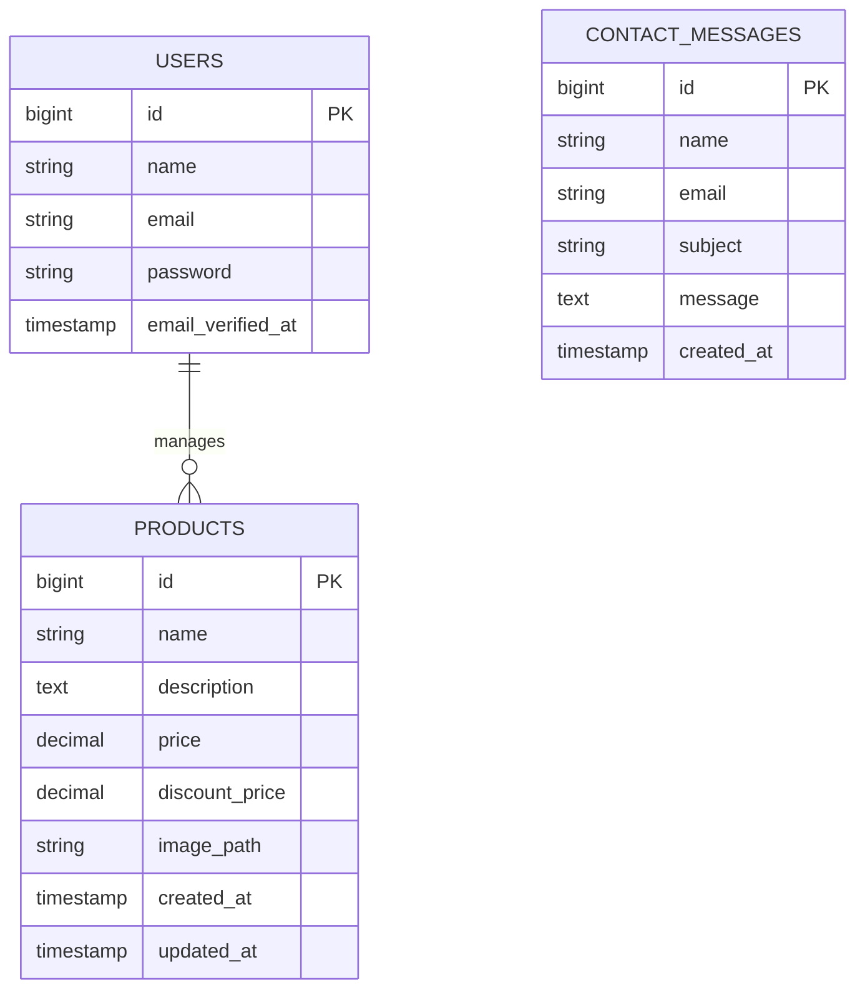
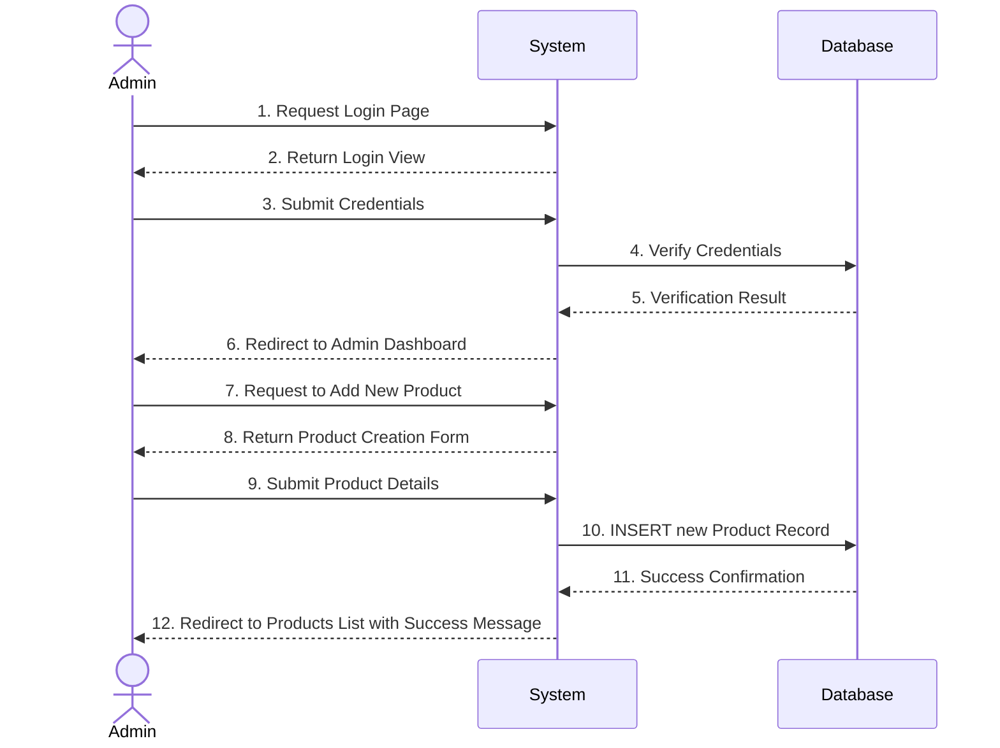

# Proposal: BigRadar Mobile Store Web Application

## 1. Group Members
| Name | Matric No |
|---|---|
| [MEMBER 1 NAME] | [MEMBER 1 MATRIC NO] |
| [MEMBER 2 NAME] | [MEMBER 2 MATRIC NO] |
| [MEMBER 3 NAME] | [MEMBER 3 MATRIC NO] |

## 2. Title of the project
**BigRadar Mobile Store**

## 3. Introduction of the proposed web application
BigRadar Mobile Store is a comprehensive e-commerce web application designed to facilitate the online browsing and purchasing of mobile devices and accessories. Leveraging the robust Laravel framework, it implements a Model-View-Controller (MVC) architecture to ensure scalability, security, and maintainability. The application features an intuitive user interface for customers to explore products, read blog posts, and contact support, while providing administrators with a secure backend to manage product inventories via full CRUD operations.

## 4. The objective of the proposed web application
- To provide a seamless and visually appealing online shopping experience for mobile devices.
- To implement standard web application architectural patterns (MVC) using PHP and Laravel.
- To offer an easy-to-use administrative interface for managing the product catalog (Create, Read, Update, Delete).
- To secure administrative features using robust user authentication mechanisms.
- To demonstrate proficiency in modern web development technologies including Blade templating, Eloquent ORM, and database migrations.

## 5. Features and functionalities of the proposed web application
1. **Product Catalog**: Visitors can browse featured products and view detailed product specifications.
2. **Dynamic Content Pages**: Includes static but dynamic-ready pages like About Us, Blog, Testimonials, and Terms.
3. **Contact System**: A functional contact form allowing visitors to send inquiries.
4. **Admin Authentication**: Secure login system to restrict access to management features.
5. **Product Management (CRUD)**: Authorized administrators can add new products, edit existing product details, delete outdated products, and view the entire inventory list.
6. **Responsive Design**: The user interface is fully responsive, ensuring optimal viewing across desktop and mobile devices.

## 6. ERD for Database Tables with Relationship

## 7. Sequence Diagram

## 8. References
1. Laravel Official Documentation: [https://laravel.com/docs](https://laravel.com/docs)
2. PHP Official Documentation: [https://www.php.net/docs.php](https://www.php.net/docs.php)
3. Bootstrap Front-end Framework: [https://getbootstrap.com/](https://getbootstrap.com/)
